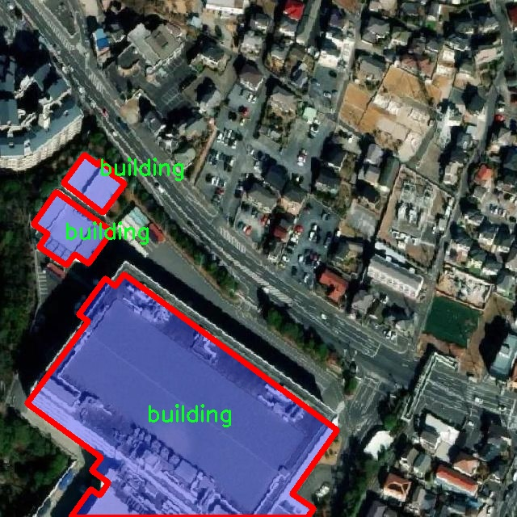

# 遥感建筑物图像分割系统源码＆数据集分享
 [yolov8-seg-p2＆yolov8-seg-LSKNet等50+全套改进创新点发刊_一键训练教程_Web前端展示]

### 1.研究背景与意义

项目参考[ILSVRC ImageNet Large Scale Visual Recognition Challenge](https://gitee.com/YOLOv8_YOLOv11_Segmentation_Studio/projects)

项目来源[AAAI Global Al lnnovation Contest](https://kdocs.cn/l/cszuIiCKVNis)

研究背景与意义

随着城市化进程的加速，建筑物的数量和种类日益增加，如何高效、准确地提取和分析建筑物信息成为遥感领域的重要研究课题。遥感技术以其广泛的应用前景和强大的数据获取能力，逐渐成为城市规划、环境监测、灾害评估等领域的重要工具。尤其是在建筑物的识别与分割方面，传统的图像处理方法往往难以满足高精度和高效率的需求。因此，基于深度学习的图像分割技术逐渐崭露头角，成为解决这一问题的有效手段。

YOLO（You Only Look Once）系列模型因其优越的实时性和准确性，在目标检测领域取得了显著的成果。YOLOv8作为该系列的最新版本，结合了多种先进的深度学习技术，具有更强的特征提取能力和更高的检测精度。然而，尽管YOLOv8在目标检测方面表现出色，但在遥感图像的建筑物实例分割任务中，仍然面临着一些挑战，如复杂背景的干扰、建筑物形状的多样性以及不同尺度建筑物的处理等。因此，改进YOLOv8以适应遥感建筑物图像分割的需求，具有重要的理论意义和实际应用价值。

本研究将围绕改进YOLOv8模型，构建一个高效的遥感建筑物图像分割系统。我们将使用“Buildings_Instance”数据集，该数据集包含1600幅建筑物图像，专注于建筑物这一单一类别。通过对该数据集的深入分析，我们可以识别出建筑物在不同环境和条件下的特征，从而为模型的改进提供有力的支持。该数据集的丰富性和多样性为模型的训练和验证提供了坚实的基础，使得我们能够在不同的场景下评估模型的性能。

在技术层面，改进YOLOv8的关键在于优化其网络结构和训练策略，以提高其在建筑物实例分割任务中的表现。我们将探索引入注意力机制、特征金字塔网络（FPN）等先进技术，以增强模型对建筑物特征的捕捉能力。同时，通过数据增强、迁移学习等手段，提高模型的泛化能力，确保其在实际应用中的有效性。

本研究的意义不仅在于提升遥感建筑物图像分割的精度和效率，更在于为城市管理、土地利用规划等领域提供强有力的技术支持。通过准确的建筑物分割，我们能够为城市规划者提供更为详实的数据基础，帮助其制定科学合理的决策。此外，该研究也为遥感图像处理领域的深度学习应用提供了新的思路和方法，推动了相关技术的发展。

综上所述，基于改进YOLOv8的遥感建筑物图像分割系统的研究，不仅具有重要的学术价值，还具备广泛的应用前景。通过本研究，我们期望能够为遥感技术在建筑物监测与管理中的应用提供新的解决方案，助力城市可持续发展。

### 2.图片演示


##### 注意：由于此博客编辑较早，上面“2.图片演示”和“3.视频演示”展示的系统图片或者视频可能为老版本，新版本在老版本的基础上升级如下：（实际效果以升级的新版本为准）

  （1）适配了YOLOV8的“目标检测”模型和“实例分割”模型，通过加载相应的权重（.pt）文件即可自适应加载模型。

  （2）支持“图片识别”、“视频识别”、“摄像头实时识别”三种识别模式。

  （3）支持“图片识别”、“视频识别”、“摄像头实时识别”三种识别结果保存导出，解决手动导出（容易卡顿出现爆内存）存在的问题，识别完自动保存结果并导出到tempDir中。

  （4）支持Web前端系统中的标题、背景图等自定义修改，后面提供修改教程。

  另外本项目提供训练的数据集和训练教程,暂不提供权重文件（best.pt）,需要您按照教程进行训练后实现图片演示和Web前端界面演示的效果。

### 3.视频演示

[3.1 视频演示](https://www.bilibili.com/video/BV12KDfYrEHQ/)

### 4.数据集信息展示

##### 4.1 本项目数据集详细数据（类别数＆类别名）

nc: 1
names: ['building']


##### 4.2 本项目数据集信息介绍

数据集信息展示

在遥感图像分析领域，建筑物的精确分割是城市规划、灾后评估和环境监测等应用的重要基础。为此，本研究采用了名为“Buildings_Instance”的数据集，以训练和改进YOLOv8-seg模型，从而实现高效的建筑物图像分割。该数据集专注于建筑物的实例分割，具有单一类别的特征，具体类别为“building”。这一设计使得数据集在处理建筑物图像时，能够集中资源和算法优化，提升模型的准确性和鲁棒性。

“Buildings_Instance”数据集包含了多种不同类型的建筑物图像，涵盖了城市、乡村及其周边环境中的各种建筑形态。这些图像的采集来源广泛，既包括高分辨率卫星图像，也包括无人机拍摄的航拍图像，确保了数据集的多样性和代表性。数据集中所包含的建筑物实例，涵盖了住宅、商业、工业等多种功能类型，反映了不同地理区域和城市布局的特征。这种多样性为模型的训练提供了丰富的样本，有助于提高其在实际应用中的泛化能力。

数据集的构建过程经过精心设计，确保每个图像中的建筑物实例都经过精确标注。标注工作由专业的遥感图像分析人员完成，使用先进的图像标注工具，确保了标注的准确性和一致性。每个建筑物实例都被精确地勾勒出轮廓，并赋予相应的标签，便于后续的模型训练和评估。这种高质量的标注数据是实现高效分割算法的关键，有助于YOLOv8-seg模型在训练过程中学习到建筑物的特征和边界。

在数据集的使用过程中，研究者可以通过对比不同模型在“Buildings_Instance”数据集上的表现，评估各自的优缺点。通过对YOLOv8-seg模型的改进，可以在数据集上进行多次实验，调整模型参数，优化网络结构，以期达到更高的分割精度和更快的推理速度。数据集的单一类别设计，使得模型的训练过程更加聚焦，能够有效减少类别间的干扰，从而提高模型对建筑物的识别能力。

此外，数据集的设计还考虑到了数据增强技术的应用，通过对原始图像进行旋转、缩放、翻转等操作，生成更多的训练样本。这种数据增强策略不仅增加了数据集的规模，还提升了模型的鲁棒性，使其能够在不同的环境条件下保持良好的性能。通过这些技术手段，研究者能够充分挖掘“Buildings_Instance”数据集的潜力，为遥感建筑物图像分割的研究提供坚实的基础。

总之，“Buildings_Instance”数据集为改进YOLOv8-seg的遥感建筑物图像分割系统提供了重要的支持。其丰富的图像资源、精确的标注和灵活的数据增强策略，确保了模型在建筑物分割任务中的高效性和准确性。这一数据集的成功应用，将为未来的遥感图像分析研究提供宝贵的经验和参考。





### 5.全套项目环境部署视频教程（零基础手把手教学）

[5.1 环境部署教程链接（零基础手把手教学）](https://www.bilibili.com/video/BV1jG4Ve4E9t/?vd_source=bc9aec86d164b67a7004b996143742dc)


[5.2 安装Python虚拟环境创建和依赖库安装视频教程链接（零基础手把手教学）](https://www.bilibili.com/video/BV1nA4VeYEze/?vd_source=bc9aec86d164b67a7004b996143742dc)

### 6.手把手YOLOV8-seg训练视频教程（零基础小白有手就能学会）

[6.1 手把手YOLOV8-seg训练视频教程（零基础小白有手就能学会）](https://www.bilibili.com/video/BV1cA4VeYETe/?vd_source=bc9aec86d164b67a7004b996143742dc)


按照上面的训练视频教程链接加载项目提供的数据集，运行train.py即可开始训练



     Epoch   gpu_mem       box       obj       cls    labels  img_size
     1/200     0G   0.01576   0.01955  0.007536        22      1280: 100%|██████████| 849/849 [14:42<00:00,  1.04s/it]
               Class     Images     Labels          P          R     mAP@.5 mAP@.5:.95: 100%|██████████| 213/213 [01:14<00:00,  2.87it/s]
                 all       3395      17314      0.994      0.957      0.0957      0.0843

     Epoch   gpu_mem       box       obj       cls    labels  img_size
     2/200     0G   0.01578   0.01923  0.007006        22      1280: 100%|██████████| 849/849 [14:44<00:00,  1.04s/it]
               Class     Images     Labels          P          R     mAP@.5 mAP@.5:.95: 100%|██████████| 213/213 [01:12<00:00,  2.95it/s]
                 all       3395      17314      0.996      0.956      0.0957      0.0845

     Epoch   gpu_mem       box       obj       cls    labels  img_size
     3/200     0G   0.01561    0.0191  0.006895        27      1280: 100%|██████████| 849/849 [10:56<00:00,  1.29it/s]
               Class     Images     Labels          P          R     mAP@.5 mAP@.5:.95: 100%|███████   | 187/213 [00:52<00:00,  4.04it/s]
                 all       3395      17314      0.996      0.957      0.0957      0.0845


### 7.50+种全套YOLOV8-seg创新点代码加载调参视频教程（一键加载写好的改进模型的配置文件）

[7.1 50+种全套YOLOV8-seg创新点代码加载调参视频教程（一键加载写好的改进模型的配置文件）](https://www.bilibili.com/video/BV1Hw4VePEXv/?vd_source=bc9aec86d164b67a7004b996143742dc)

### 8.YOLOV8-seg图像分割算法原理

原始YOLOv8-seg算法原理

YOLOv8-seg算法是基于YOLOv8模型的最新版本，专注于目标检测与分割任务。该算法的提出旨在进一步提升目标检测的精度和效率，同时实现对目标的精细分割。YOLOv8-seg的设计思路源于YOLO系列模型的成功经验，并结合了近年来在深度学习领域的诸多创新与改进，尤其是在特征提取和任务对齐方面的进展。

在YOLOv8-seg中，输入图像首先经过一系列的预处理步骤，包括缩放和归一化，以适应模型的输入要求。与传统的YOLO模型类似，YOLOv8-seg也采用了主干网络、颈部网络和头部网络的结构。主干网络负责从输入图像中提取丰富的特征信息。在这一阶段，YOLOv8-seg引入了C2f模块，取代了以往的C3模块。C2f模块通过跨层连接和分支结构，增强了模型的梯度流动性，使得特征提取更加高效。这种设计不仅提高了特征的表达能力，还在一定程度上减轻了模型的计算负担。

在主干网络的末尾，YOLOv8-seg采用了快速空间金字塔池化（SPPF）结构，该结构通过多个最大池化层对不同尺度的特征进行处理，从而提升了网络对多尺度目标的识别能力。此时，网络已经能够提取到丰富的上下文信息，为后续的目标检测和分割任务奠定了坚实的基础。

颈部网络则起到了特征融合的关键作用。YOLOv8-seg采用了特征金字塔网络（FPN）和路径聚合网络（PAN）的组合结构，以有效整合来自不同尺度的特征图。这一阶段的设计旨在提升模型对复杂场景的适应能力，确保在目标大小、形状和背景复杂度变化时，模型依然能够保持较高的检测和分割精度。

在头部网络中，YOLOv8-seg引入了解耦的检测头结构，分别处理目标的分类和定位任务。具体而言，模型通过两个并行的卷积分支，分别计算类别和位置的损失。这种设计思路源于YOLOX的成功经验，旨在通过专注于不同任务的特征提取，提升模型的收敛速度和预测精度。此外，YOLOv8-seg还采用了无锚框（Anchor-Free）检测方式，直接预测目标的中心点和宽高比例。这一创新显著减少了对Anchor框的依赖，提高了模型的检测速度和准确度。

在任务对齐方面，YOLOv8-seg引入了任务对齐学习（TAL）机制，通过引入分类分数和IOU的高次幂乘积作为衡量任务对齐程度的指标，确保在分类和定位损失函数中均衡考虑。这一机制的引入，使得模型在进行目标检测时，能够更好地兼顾定位精度和分类准确性，从而提升整体性能。

YOLOv8-seg在训练过程中，针对数据增强策略进行了优化。尽管Mosaic数据增强在提升模型鲁棒性和泛化性方面表现出色，但其在某些情况下可能会破坏数据的真实分布。因此，YOLOv8-seg在训练的最后10个epoch中停止使用Mosaic数据增强，以确保模型学习到的特征更加真实和有效。

在实际应用中，YOLOv8-seg展现出了卓越的性能，尤其是在复杂场景下的目标检测与分割任务中。通过对COCO数据集的测试，YOLOv8-seg在精度和速度上均表现优异，mAP（mean Average Precision）指标显示出其在同类模型中的竞争力。与其他YOLO系列模型相比，YOLOv8-seg在保持较小模型参数的前提下，取得了更高的检测精度和更快的推理速度，充分证明了其在实时目标检测与分割任务中的应用潜力。

总之，YOLOv8-seg算法的设计与实现，充分体现了深度学习领域在目标检测与分割任务中的最新研究成果。通过对网络结构的优化、特征提取的改进以及任务对齐机制的引入，YOLOv8-seg不仅提升了目标检测的准确性和效率，也为未来的研究与应用提供了新的思路和方向。随着YOLOv8-seg在实际场景中的不断应用，其在智能监控、自动驾驶、机器人视觉等领域的潜力将进一步得到挖掘与验证。


### 9.系统功能展示（检测对象为举例，实际内容以本项目数据集为准）

图9.1.系统支持检测结果表格显示

  图9.2.系统支持置信度和IOU阈值手动调节

  图9.3.系统支持自定义加载权重文件best.pt(需要你通过步骤5中训练获得)

  图9.4.系统支持摄像头实时识别

  图9.5.系统支持图片识别

  图9.6.系统支持视频识别

  图9.7.系统支持识别结果文件自动保存

  图9.8.系统支持Excel导出检测结果数据


### 10.50+种全套YOLOV8-seg创新点原理讲解（非科班也可以轻松写刊发刊，V11版本正在科研待更新）

#### 10.1 由于篇幅限制，每个创新点的具体原理讲解就不一一展开，具体见下列网址中的创新点对应子项目的技术原理博客网址【Blog】：


[10.1 50+种全套YOLOV8-seg创新点原理讲解链接](https://gitee.com/qunmasj/good)

#### 10.2 部分改进模块原理讲解(完整的改进原理见上图和技术博客链接)【如果此小节的图加载失败可以通过CSDN或者Github搜索该博客的标题访问原始博客，原始博客图片显示正常】
### YOLOv8算法原理
YOLOv8算法由Glenn-Jocher 提出，是跟YOLOv3算法、YOLOv5算法一脉相承的，主要的改进点如下:
(1)数据预处理。YOLOv8的数据预处理依旧采用YOLOv5的策略,在训练时，主要采用包括马赛克增强(Mosaic)、混合增强(Mixup)、空间扰动(randomperspective)以及颜色扰动(HSV augment)四个增强手段。
(2)骨干网络结构。YOLOv8的骨干网络结构可从YOLOv5略见一斑，YOLOv5的主干网络的架构规律十分清晰，总体来看就是每用一层步长为2的3×3卷积去降采样特征图，接一个C3模块来进一步强化其中的特征，且C3的基本深度参数分别为“3/6/9/3”，其会根据不同规模的模型的来做相应的缩放。在的YOLOv8中，大体上也还是继承了这一特点，原先的C3模块均被替换成了新的C2f模块，C2f 模块加入更多的分支，丰富梯度回传时的支流。下面展示了YOLOv8的C2f模块和YOLOv5的C3模块，其网络结构图所示。


(3)FPN-PAN结构。YOLOv8仍采用FPN+PAN结构来构建YOLO的特征金字塔，使多尺度信息之间进行充分的融合。除了FPN-PAN里面的C3模块被替换为C2f模块外，其余部分与YOLOv5的FPN-PAN结构基本一致。
(4)Detection head结构。从 YOLOv3到 YOLOv5，其检测头一直都是“耦合”(Coupled)的,即使用一层卷积同时完成分类和定位两个任务，直到YOLOX的问世， YOLO系列才第一次换装“解耦头”(Decoupled Head)。YOLOv8也同样也采用了解耦头的结构，两条并行的分支分别取提取类别特征和位置特征，然后各用一层1x1卷积完成分类和定位任务。YOLOv8整体的网络结构由图所示。


(5)标签分配策略。尽管YOLOv5设计了自动聚类候选框的一些功能，但是聚类候选框是依赖于数据集的。若数据集不够充分，无法较为准确地反映数据本身的分布特征，聚类出来的候选框也会与真实物体尺寸比例悬殊过大。YOLOv8没有采用候选框策略，所以解决的问题就是正负样本匹配的多尺度分配。不同于YOLOX所使用的 SimOTA，YOLOv8在标签分配问题上采用了和YOLOv6相同的TOOD策略，是一种动态标签分配策略。YOLOv8只用到了targetboze。和target scores，未含是否有物体预测，故 YOLOv8的损失就主要包括两大部分∶类别损失和位置损失。对于YOLOv8，其分类损失为VFLLoss(Varifocal Loss)，其回归损失为CIoU Loss 与 DFL Loss 的形式。
其中 Varifocal Loss定义如下:


其中p为预测的类别得分，p ∈ [0.1]。q为预测的目标分数(若为真实类别，则q为预测和真值的 loU;若为其他类别。q为0 )。VFL Loss使用不对称参数来对正负样本进行加权，通过只对负样本进行衰减，达到不对等的处理前景和背景对损失的贡献。对正样本，使用q进行了加权，如果正样本的GTiou很高时,则对损失的贡献更大一些，可以让网络聚焦于那些高质量的样本上，即训练高质量的正例对AP的提升比低质量的更大一些。对负样本，使用p进行了降权，降低了负例对损失的贡献，因负样本的预测p在取次幂后会变得更小，这样就能够降低负样本对损失的整体贡献。

### 动态蛇形卷积Dynamic Snake Convolution

参考论文： 2307.08388.pdf (arxiv.org)

血管、道路等拓扑管状结构的精确分割在各个领域都至关重要，确保下游任务的准确性和效率。 然而，许多因素使任务变得复杂，包括薄的局部结构和可变的全局形态。在这项工作中，我们注意到管状结构的特殊性，并利用这些知识来指导我们的 DSCNet 在三个阶段同时增强感知：特征提取、特征融合、 和损失约束。 首先，我们提出了一种动态蛇卷积，通过自适应地关注细长和曲折的局部结构来准确捕获管状结构的特征。 随后，我们提出了一种多视图特征融合策略，以补充特征融合过程中多角度对特征的关注，确保保留来自不同全局形态的重要信息。 最后，提出了一种基于持久同源性的连续性约束损失函数，以更好地约束分割的拓扑连续性。 2D 和 3D 数据集上的实验表明，与多种方法相比，我们的 DSCNet 在管状结构分割任务上提供了更好的准确性和连续性。 我们的代码是公开的。 
主要的挑战源于细长微弱的局部结构特征与复杂多变的全局形态特征。本文关注到管状结构细长连续的特点，并利用这一信息在神经网络以下三个阶段同时增强感知：特征提取、特征融合和损失约束。分别设计了动态蛇形卷积（Dynamic Snake Convolution），多视角特征融合策略与连续性拓扑约束损失。 

我们希望卷积核一方面能够自由地贴合结构学习特征，另一方面能够在约束条件下不偏离目标结构太远。在观察管状结构的细长连续的特征后，脑海里想到了一个动物——蛇。我们希望卷积核能够像蛇一样动态地扭动，来贴合目标的结构。

我们希望卷积核一方面能够自由地贴合结构学习特征，另一方面能够在约束条件下不偏离目标结构太远。在观察管状结构的细长连续的特征后，脑海里想到了一个动物——蛇。我们希望卷积核能够像蛇一样动态地扭动，来贴合目标的结构。


### DCNV2融入YOLOv8
DCN和DCNv2（可变性卷积）
网上关于两篇文章的详细描述已经很多了，我这里具体的细节就不多讲了，只说一下其中实现起来比较困惑的点。（黑体字会讲解）

DCNv1解决的问题就是我们常规的图像增强，仿射变换（线性变换加平移）不能解决的多种形式目标变换的几何变换的问题。如下图所示。

可变性卷积的思想很简单，就是讲原来固定形状的卷积核变成可变的。如下图所示：


首先来看普通卷积，以3x3卷积为例对于每个输出y(p0)，都要从x上采样9个位置，这9个位置都在中心位置x(p0)向四周扩散得到的gird形状上，(-1,-1)代表x(p0)的左上角，(1,1)代表x(p0)的右下角，其他类似。

用公式表示如下：


可变性卷积Deformable Conv操作并没有改变卷积的计算操作，而是在卷积操作的作用区域上，加入了一个可学习的参数∆pn。同样对于每个输出y(p0)，都要从x上采样9个位置，这9个位置是中心位置x(p0)向四周扩散得到的，但是多了 ∆pn，允许采样点扩散成非gird形状。


偏移量是通过对原始特征层进行卷积得到的。比如输入特征层是w×h×c，先对输入的特征层进行卷积操作，得到w×h×2c的offset field。这里的w和h和原始特征层的w和h是一致的，offset field里面的值是输入特征层对应位置的偏移量，偏移量有x和y两个方向，所以offset field的channel数是2c。offset field里的偏移量是卷积得到的，可能是浮点数，所以接下来需要通过双向性插值计算偏移位置的特征值。在偏移量的学习中，梯度是通过双线性插值来进行反向传播的。
看到这里是不是还是有点迷茫呢？那到底程序上面怎么实现呢？


事实上由上面的公式我们可以看得出来∆pn这个偏移量是加在原像素点上的，但是我们怎么样从代码上对原像素点加这个量呢？其实很简单，就是用一个普通的卷积核去跟输入图片（一般是输入的feature_map）卷积就可以了卷积核的数量是2N也就是23*3==18（前9个通道是x方向的偏移量，后9个是y方向的偏移量），然后把这个卷积的结果与正常卷积的结果进行相加就可以了。
然后又有了第二个问题，怎么样反向传播呢？为什么会有这个问题呢？因为求出来的偏移量+正常卷积输出的结果往往是一个浮点数，浮点数是无法对应到原图的像素点的，所以自然就想到了双线性差值的方法求出浮点数对应的浮点像素点。


#### DCN v2
对于positive的样本来说，采样的特征应该focus在RoI内，如果特征中包含了过多超出RoI的内容，那么结果会受到影响和干扰。而negative样本则恰恰相反，引入一些超出RoI的特征有助于帮助网络判别这个区域是背景区域。

DCNv1引入了可变形卷积，能更好的适应目标的几何变换。但是v1可视化结果显示其感受野对应位置超出了目标范围，导致特征不受图像内容影响（理想情况是所有的对应位置分布在目标范围以内）。

为了解决该问题：提出v2, 主要有

1、扩展可变形卷积，增强建模能力
2、提出了特征模拟方案指导网络培训：feature mimicking scheme

上面这段话是什么意思呢，通俗来讲就是，我们的可变性卷积的区域大于目标所在区域，所以这时候就会对非目标区域进行错误识别。

所以自然能想到的解决方案就是加入权重项进行惩罚。（至于这个实现起来就比较简单了，直接初始化一个权重然后乘(input+offsets)就可以了）


可调节的RoIpooling也是类似的，公式如下：


### 11.项目核心源码讲解（再也不用担心看不懂代码逻辑）

#### 11.1 ultralytics\utils\tal.py

以下是经过简化和注释的核心代码部分，主要涉及目标检测中的任务对齐分配器（TaskAlignedAssigner）及其相关函数。

```python
import torch
import torch.nn as nn

def select_candidates_in_gts(xy_centers, gt_bboxes, eps=1e-9):
    """
    选择在真实框(gt)中的正锚点中心。

    参数:
        xy_centers (Tensor): 形状为(h*w, 2)的锚点中心坐标
        gt_bboxes (Tensor): 形状为(b, n_boxes, 4)的真实框坐标

    返回:
        (Tensor): 形状为(b, n_boxes, h*w)的布尔张量，表示每个锚点是否在真实框内
    """
    n_anchors = xy_centers.shape[0]
    bs, n_boxes, _ = gt_bboxes.shape
    lt, rb = gt_bboxes.view(-1, 1, 4).chunk(2, 2)  # 左上角和右下角
    bbox_deltas = torch.cat((xy_centers[None] - lt, rb - xy_centers[None]), dim=2).view(bs, n_boxes, n_anchors, -1)
    return bbox_deltas.amin(3).gt_(eps)  # 返回每个锚点是否在真实框内的布尔值

class TaskAlignedAssigner(nn.Module):
    """
    任务对齐分配器，用于目标检测。

    属性:
        topk (int): 考虑的最佳候选框数量。
        num_classes (int): 目标类别数量。
        alpha (float): 分类组件的超参数。
        beta (float): 定位组件的超参数。
        eps (float): 防止除以零的小值。
    """

    def __init__(self, topk=13, num_classes=80, alpha=1.0, beta=6.0, eps=1e-9):
        """初始化任务对齐分配器对象，设置超参数。"""
        super().__init__()
        self.topk = topk
        self.num_classes = num_classes
        self.bg_idx = num_classes  # 背景类别索引
        self.alpha = alpha
        self.beta = beta
        self.eps = eps

    @torch.no_grad()
    def forward(self, pd_scores, pd_bboxes, anc_points, gt_labels, gt_bboxes, mask_gt):
        """
        计算任务对齐分配。

        参数:
            pd_scores (Tensor): 形状为(bs, num_total_anchors, num_classes)的预测分数
            pd_bboxes (Tensor): 形状为(bs, num_total_anchors, 4)的预测边界框
            anc_points (Tensor): 形状为(num_total_anchors, 2)的锚点坐标
            gt_labels (Tensor): 形状为(bs, n_max_boxes, 1)的真实框标签
            gt_bboxes (Tensor): 形状为(bs, n_max_boxes, 4)的真实框坐标
            mask_gt (Tensor): 形状为(bs, n_max_boxes, 1)的真实框掩码

        返回:
            target_labels (Tensor): 形状为(bs, num_total_anchors)的目标标签
            target_bboxes (Tensor): 形状为(bs, num_total_anchors, 4)的目标边界框
            target_scores (Tensor): 形状为(bs, num_total_anchors, num_classes)的目标分数
            fg_mask (Tensor): 形状为(bs, num_total_anchors)的前景掩码
            target_gt_idx (Tensor): 形状为(bs, num_total_anchors)的目标真实框索引
        """
        self.bs = pd_scores.size(0)
        self.n_max_boxes = gt_bboxes.size(1)

        if self.n_max_boxes == 0:
            device = gt_bboxes.device
            return (torch.full_like(pd_scores[..., 0], self.bg_idx).to(device), 
                    torch.zeros_like(pd_bboxes).to(device),
                    torch.zeros_like(pd_scores).to(device), 
                    torch.zeros_like(pd_scores[..., 0]).to(device),
                    torch.zeros_like(pd_scores[..., 0]).to(device))

        # 获取正锚点掩码和对齐度量
        mask_pos, align_metric, overlaps = self.get_pos_mask(pd_scores, pd_bboxes, gt_labels, gt_bboxes, anc_points, mask_gt)

        # 选择重叠度最高的真实框
        target_gt_idx, fg_mask, mask_pos = select_highest_overlaps(mask_pos, overlaps, self.n_max_boxes)

        # 获取目标标签、边界框和分数
        target_labels, target_bboxes, target_scores = self.get_targets(gt_labels, gt_bboxes, target_gt_idx, fg_mask)

        # 归一化对齐度量
        align_metric *= mask_pos
        pos_align_metrics = align_metric.amax(dim=-1, keepdim=True)  # b, max_num_obj
        pos_overlaps = (overlaps * mask_pos).amax(dim=-1, keepdim=True)  # b, max_num_obj
        norm_align_metric = (align_metric * pos_overlaps / (pos_align_metrics + self.eps)).amax(-2).unsqueeze(-1)
        target_scores = target_scores * norm_align_metric

        return target_labels, target_bboxes, target_scores, fg_mask.bool(), target_gt_idx

    def get_pos_mask(self, pd_scores, pd_bboxes, gt_labels, gt_bboxes, anc_points, mask_gt):
        """获取正锚点掩码。"""
        mask_in_gts = select_candidates_in_gts(anc_points, gt_bboxes)  # 选择在真实框内的锚点
        align_metric, overlaps = self.get_box_metrics(pd_scores, pd_bboxes, gt_labels, gt_bboxes, mask_in_gts * mask_gt)  # 计算对齐度量和重叠度
        mask_topk = self.select_topk_candidates(align_metric, topk_mask=mask_gt.expand(-1, -1, self.topk).bool())  # 选择前k个候选
        mask_pos = mask_topk * mask_in_gts * mask_gt  # 合并掩码

        return mask_pos, align_metric, overlaps

    def get_box_metrics(self, pd_scores, pd_bboxes, gt_labels, gt_bboxes, mask_gt):
        """计算给定预测和真实边界框的对齐度量。"""
        na = pd_bboxes.shape[-2]
        mask_gt = mask_gt.bool()  # 转换为布尔类型
        overlaps = torch.zeros([self.bs, self.n_max_boxes, na], dtype=pd_bboxes.dtype, device=pd_bboxes.device)
        bbox_scores = torch.zeros([self.bs, self.n_max_boxes, na], dtype=pd_scores.dtype, device=pd_scores.device)

        ind = torch.zeros([2, self.bs, self.n_max_boxes], dtype=torch.long)  # 2, b, max_num_obj
        ind[0] = torch.arange(end=self.bs).view(-1, 1).expand(-1, self.n_max_boxes)  # b, max_num_obj
        ind[1] = gt_labels.squeeze(-1)  # b, max_num_obj
        bbox_scores[mask_gt] = pd_scores[ind[0], :, ind[1]][mask_gt]  # 获取每个网格的分数

        # 计算重叠度
        pd_boxes = pd_bboxes.unsqueeze(1).expand(-1, self.n_max_boxes, -1, -1)[mask_gt]
        gt_boxes = gt_bboxes.unsqueeze(2).expand(-1, -1, na, -1)[mask_gt]
        overlaps[mask_gt] = bbox_iou(gt_boxes, pd_boxes, xywh=False, CIoU=True).squeeze(-1).clamp_(0)

        align_metric = bbox_scores.pow(self.alpha) * overlaps.pow(self.beta)  # 计算对齐度量
        return align_metric, overlaps

    def get_targets(self, gt_labels, gt_bboxes, target_gt_idx, fg_mask):
        """
        计算正锚点的目标标签、目标边界框和目标分数。

        参数:
            gt_labels (Tensor): 真实框标签
            gt_bboxes (Tensor): 真实框坐标
            target_gt_idx (Tensor): 正锚点的真实框索引
            fg_mask (Tensor): 前景掩码

        返回:
            (Tuple[Tensor, Tensor, Tensor]): 包含目标标签、目标边界框和目标分数的元组
        """
        batch_ind = torch.arange(end=self.bs, dtype=torch.int64, device=gt_labels.device)[..., None]
        target_gt_idx = target_gt_idx + batch_ind * self.n_max_boxes  # 计算目标真实框索引
        target_labels = gt_labels.long().flatten()[target_gt_idx]  # 获取目标标签

        target_bboxes = gt_bboxes.view(-1, 4)[target_gt_idx]  # 获取目标边界框
        target_labels.clamp_(0)  # 限制标签范围

        # 计算目标分数
        target_scores = torch.zeros((target_labels.shape[0], target_labels.shape[1], self.num_classes),
                                    dtype=torch.int64,
                                    device=target_labels.device)  # 创建目标分数张量
        target_scores.scatter_(2, target_labels.unsqueeze(-1), 1)  # 填充目标分数

        fg_scores_mask = fg_mask[:, :, None].repeat(1, 1, self.num_classes)  # 扩展前景掩码
        target_scores = torch.where(fg_scores_mask > 0, target_scores, 0)  # 仅保留前景分数

        return target_labels, target_bboxes, target_scores
```

### 主要功能
1. **选择候选锚点**：通过`select_candidates_in_gts`函数，选择在真实框内的锚点。
2. **任务对齐分配器**：`TaskAlignedAssigner`类实现了对锚点的分配，结合了分类和定位信息。
3. **计算对齐度量**：通过`get_box_metrics`计算预测边界框与真实框之间的对齐度量。
4. **获取目标信息**：通过`get_targets`获取目标标签、边界框和分数。

### 注意事项
- 代码中的`bbox_iou`函数用于计算边界框的重叠度。
- `mask_gt`用于指示哪些真实框是有效的，避免对无效框进行计算。

这个文件是Ultralytics YOLO（You Only Look Once）项目中的一个模块，主要负责目标检测中的任务对齐分配（Task-Aligned Assignment）。它使用PyTorch框架实现，主要包含了选择正样本锚框、计算重叠度、生成锚框、以及将边界框转换为距离等功能。

首先，文件导入了必要的库，包括PyTorch和一些自定义的模块。接着，定义了一个函数`select_candidates_in_gts`，该函数用于选择在真实边界框（ground truth, gt）内的正锚框中心。它接收锚框中心和真实边界框作为输入，返回一个布尔张量，指示哪些锚框中心是正样本。

接下来，`select_highest_overlaps`函数用于处理当一个锚框被多个真实边界框分配时的情况。它选择与每个锚框重叠度最高的真实边界框，并返回相关的索引和掩码。

然后，定义了一个名为`TaskAlignedAssigner`的类，继承自`nn.Module`。这个类的主要功能是根据任务对齐的度量标准，将真实对象分配给锚框。它的构造函数初始化了一些超参数，包括考虑的候选框数量、类别数量、分类和定位的权重等。

在`forward`方法中，首先获取输入的预测分数、预测边界框、锚框中心、真实标签和真实边界框等信息。如果没有真实边界框，则返回背景索引和零张量。接着，调用`get_pos_mask`方法获取正样本掩码和对齐度量。然后，使用`select_highest_overlaps`选择重叠度最高的真实边界框，并通过`get_targets`方法计算目标标签、目标边界框和目标分数。

`get_pos_mask`方法负责获取在真实边界框内的锚框掩码，并计算对齐度量和重叠度。`get_box_metrics`方法计算预测边界框与真实边界框之间的对齐度量，使用了IoU（Intersection over Union）作为重叠度的计算方式。`select_topk_candidates`方法根据给定的度量选择前k个候选框。

`get_targets`方法计算正样本锚框的目标标签、目标边界框和目标分数。它通过索引获取对应的真实标签和边界框，并根据前景掩码生成目标分数。

此外，文件中还定义了一些辅助函数，如`make_anchors`用于生成锚框，`dist2bbox`和`bbox2dist`用于在边界框和距离表示之间进行转换。这些函数在目标检测过程中起到重要的作用，帮助模型更好地理解和定位目标。

总的来说，这个文件实现了YOLO目标检测模型中锚框分配的核心逻辑，通过结合分类和定位信息，优化了锚框与真实目标之间的匹配。

#### 11.2 ultralytics\solutions\__init__.py

以下是对代码的核心部分进行保留和详细注释的版本：

```python
# Ultralytics YOLO 🚀, AGPL-3.0 license

# 该代码是YOLO（You Only Look Once）目标检测模型的实现部分。
# YOLO是一种实时目标检测系统，能够在单个神经网络中同时进行目标定位和分类。

# 这里省略了具体的实现细节和模型结构，只保留了核心概念。

# 定义YOLO模型的类
class YOLO:
    def __init__(self, model_path):
        # 初始化YOLO模型
        # model_path: 预训练模型的路径
        self.model = self.load_model(model_path)  # 加载模型

    def load_model(self, model_path):
        # 加载预训练的YOLO模型
        # 这里可以使用深度学习框架（如PyTorch或TensorFlow）来加载模型
        pass  # 具体实现省略

    def detect(self, image):
        # 对输入图像进行目标检测
        # image: 输入的图像数据
        results = self.model.predict(image)  # 使用模型进行预测
        return results  # 返回检测结果

# 使用示例
if __name__ == "__main__":
    yolo = YOLO("path/to/model")  # 创建YOLO模型实例
    image = "path/to/image.jpg"  # 输入图像路径
    detections = yolo.detect(image)  # 进行目标检测
    print(detections)  # 输出检测结果
```

### 注释说明：
1. **YOLO类**：这是YOLO模型的核心类，负责模型的初始化和目标检测功能。
2. **__init__方法**：构造函数，用于初始化YOLO模型并加载预训练的权重。
3. **load_model方法**：负责加载YOLO模型的具体实现，通常会涉及到深度学习框架的相关调用。
4. **detect方法**：输入一张图像，使用模型进行目标检测，并返回检测结果。
5. **使用示例**：展示如何创建YOLO模型实例并对图像进行目标检测的基本流程。

这个代码片段的核心功能是实现YOLO模型的加载和目标检测，而具体的模型细节和实现可以根据需要进一步扩展。

这个程序文件的文件名是 `__init__.py`，位于 `ultralytics/solutions` 目录下。根据文件名和路径可以推测，这个文件是一个 Python 包的初始化文件。它的主要作用是标识 `solutions` 目录为一个 Python 包，使得 Python 解释器能够识别并导入其中的模块。

文件开头的注释 `# Ultralytics YOLO 🚀, AGPL-3.0 license` 表明这个包与 Ultralytics 的 YOLO（You Only Look Once）模型相关，YOLO 是一种广泛使用的目标检测算法。注释中提到的 AGPL-3.0 许可证是一个开源许可证，允许用户自由使用、修改和分发软件，但要求在分发时也必须以相同的许可证提供源代码。

总的来说，这个文件的存在是为了支持 Ultralytics YOLO 项目的模块化结构，方便用户在 Python 中导入和使用该项目的功能。虽然文件中没有具体的代码实现，但它在包的组织和结构上起到了重要的作用。

#### 11.3 model.py

以下是经过简化和详细注释的核心代码部分：

```python
# -*- coding: utf-8 -*-
import cv2  # 导入OpenCV库，用于处理图像和视频
import torch  # 导入PyTorch库，用于深度学习模型的处理
from ultralytics import YOLO  # 从ultralytics库中导入YOLO类，用于加载YOLO模型
from ultralytics.utils.torch_utils import select_device  # 导入设备选择函数

# 选择设备，优先使用GPU
device = "cuda:0" if torch.cuda.is_available() else "cpu"

# 初始化参数字典
ini_params = {
    'device': device,  # 设备类型
    'conf': 0.3,  # 物体置信度阈值
    'iou': 0.05,  # IOU阈值，用于非极大值抑制
    'classes': None,  # 类别过滤器
    'verbose': False  # 是否详细输出
}

class Web_Detector:  # 定义Web_Detector类
    def __init__(self, params=None):  # 构造函数
        self.model = None  # 初始化模型为None
        self.params = params if params else ini_params  # 使用提供的参数或默认参数

    def load_model(self, model_path):  # 加载模型的方法
        self.device = select_device(self.params['device'])  # 选择设备
        self.model = YOLO(model_path)  # 加载YOLO模型
        # 预热模型以提高后续推理速度
        self.model(torch.zeros(1, 3, 640, 640).to(self.device).type_as(next(self.model.model.parameters())))

    def predict(self, img):  # 预测方法
        results = self.model(img, **ini_params)  # 使用模型进行预测
        return results  # 返回预测结果

    def postprocess(self, pred):  # 后处理方法
        results = []  # 初始化结果列表
        for res in pred[0].boxes:  # 遍历预测结果中的每个边界框
            class_id = int(res.cls.cpu())  # 获取类别ID
            bbox = res.xyxy.cpu().squeeze().tolist()  # 获取边界框坐标
            bbox = [int(coord) for coord in bbox]  # 转换为整数

            result = {
                "class_name": self.model.names[class_id],  # 类别名称
                "bbox": bbox,  # 边界框
                "score": res.conf.cpu().squeeze().item(),  # 置信度
                "class_id": class_id  # 类别ID
            }
            results.append(result)  # 将结果添加到列表

        return results  # 返回结果列表
```

### 代码说明：
1. **库导入**：导入了必要的库，包括OpenCV、PyTorch和YOLO模型相关的库。
2. **设备选择**：根据是否有可用的GPU选择设备。
3. **参数初始化**：定义了一些参数，如置信度阈值和IOU阈值。
4. **Web_Detector类**：定义了一个检测器类，包含模型加载、预测和后处理的方法。
   - `__init__`：构造函数，初始化模型和参数。
   - `load_model`：加载YOLO模型并进行预热。
   - `predict`：使用模型进行图像预测。
   - `postprocess`：处理预测结果，提取类别名称、边界框和置信度等信息，并返回结果列表。

这个程序文件 `model.py` 是一个用于目标检测的实现，主要依赖于 OpenCV 和 YOLO 模型。程序的核心功能是加载 YOLO 模型，进行图像预处理、预测和后处理，并提供对检测结果的统计和分类。

首先，程序导入了必要的库，包括 OpenCV、PyTorch、QtFusion 和 ultralytics 等。通过判断是否有可用的 GPU，程序设置了计算设备为 CUDA 或 CPU，并定义了一些初始参数，例如物体置信度阈值和 IOU 阈值。

接下来，定义了一个名为 `count_classes` 的函数，用于统计检测结果中每个类别的数量。该函数接收检测信息和类别名称列表，遍历检测信息并更新每个类别的计数，最后返回一个按类别顺序排列的计数列表。

程序中定义了一个 `Web_Detector` 类，继承自 `Detector` 抽象基类。该类的构造函数初始化了一些属性，包括模型、图像和类别名称等。如果没有提供参数，则使用预设的初始参数。

`load_model` 方法用于加载指定路径的 YOLO 模型。根据模型文件名的前缀判断任务类型，并使用 `YOLO` 类加载模型。加载后，程序会将类别名称转换为中文，并进行模型的预热，以确保模型可以正常工作。

`preprocess` 方法负责图像的预处理，简单地将输入图像保存并返回。`predict` 方法则调用模型进行预测，返回检测结果。

在 `postprocess` 方法中，程序对预测结果进行后处理，提取每个检测框的信息，包括类别名称、边界框坐标、置信度和类别 ID。若存在分割掩码，也会将其包含在结果中。最终，处理后的结果以列表形式返回。

最后，`set_param` 方法允许用户更新检测器的参数，确保灵活性和可配置性。

整体而言，这个程序文件实现了一个完整的目标检测流程，能够加载模型、处理图像并输出检测结果，适用于需要图像分析和目标识别的应用场景。

#### 11.4 ultralytics\models\fastsam\__init__.py

以下是代码中最核心的部分，并附上详细的中文注释：

```python
# 导入必要的模块和类
from .model import FastSAM  # 导入 FastSAM 模型类
from .predict import FastSAMPredictor  # 导入用于预测的 FastSAMPredictor 类
from .prompt import FastSAMPrompt  # 导入用于提示的 FastSAMPrompt 类
from .val import FastSAMValidator  # 导入用于验证的 FastSAMValidator 类

# 定义模块的公开接口，允许外部访问这些类
__all__ = 'FastSAMPredictor', 'FastSAM', 'FastSAMPrompt', 'FastSAMValidator'
```

### 代码注释说明：
1. **导入模块**：
   - 通过 `from .model import FastSAM` 等语句，从当前包中导入所需的类。这些类分别用于模型定义、预测、提示和验证等功能。

2. **`__all__` 变量**：
   - `__all__` 是一个特殊变量，用于定义当使用 `from module import *` 时，哪些类或函数是可以被导出的。在这里，它包含了四个类：`FastSAMPredictor`、`FastSAM`、`FastSAMPrompt` 和 `FastSAMValidator`，这意味着这四个类是模块的公共接口，外部可以直接使用。

这个程序文件是一个Python模块的初始化文件，位于`ultralytics\models\fastsam`目录下。文件的主要功能是导入和定义该模块中可用的类和函数，以便其他模块可以方便地使用。

首先，文件开头有一行注释，表明该代码属于Ultralytics YOLO项目，并且遵循AGPL-3.0许可证。这说明该项目是开源的，用户可以自由使用和修改，但需要遵循相应的许可证条款。

接下来，文件通过`from .model import FastSAM`等语句导入了四个主要的组件：`FastSAM`、`FastSAMPredictor`、`FastSAMPrompt`和`FastSAMValidator`。这些组件分别位于同一目录下的不同文件中，具体的功能可能与快速图像分割、预测、提示和验证等相关。

最后，`__all__`变量被定义为一个元组，包含了上述导入的类名。这一行的作用是明确指出当使用`from ultralytics.models.fastsam import *`语句时，哪些名称会被导入。这是一种封装机制，可以控制模块的公共接口，避免不必要的名称冲突。

总体而言，这个初始化文件的主要作用是组织和简化模块的导入，使得使用者可以更方便地访问和使用`FastSAM`相关的功能。

#### 11.5 train.py

以下是代码中最核心的部分，并附上详细的中文注释：

```python
import os
import torch
import yaml
from ultralytics import YOLO  # 导入YOLO模型库

if __name__ == '__main__':  # 确保该模块被直接运行时才执行以下代码
    # 设置训练参数
    workers = 1  # 数据加载的工作进程数量
    batch = 8  # 每个批次的样本数量，根据显存/内存情况调整
    device = "0" if torch.cuda.is_available() else "cpu"  # 判断是否使用GPU

    # 获取数据集的yaml配置文件的绝对路径
    data_path = abs_path(f'datasets/data/data.yaml', path_type='current')  

    # 将路径转换为Unix风格
    unix_style_path = data_path.replace(os.sep, '/')
    # 获取目录路径
    directory_path = os.path.dirname(unix_style_path)

    # 读取YAML文件，保持原有顺序
    with open(data_path, 'r') as file:
        data = yaml.load(file, Loader=yaml.FullLoader)

    # 修改数据集路径
    if 'train' in data and 'val' in data and 'test' in data:
        data['train'] = directory_path + '/train'  # 更新训练集路径
        data['val'] = directory_path + '/val'      # 更新验证集路径
        data['test'] = directory_path + '/test'    # 更新测试集路径

        # 将修改后的数据写回YAML文件
        with open(data_path, 'w') as file:
            yaml.safe_dump(data, file, sort_keys=False)

    # 加载YOLO模型配置文件和预训练权重
    model = YOLO(r"C:\codeseg\codenew\50+种YOLOv8算法改进源码大全和调试加载训练教程（非必要）\改进YOLOv8模型配置文件\yolov8-seg-C2f-Faster.yaml").load("./weights/yolov8s-seg.pt")

    # 开始训练模型
    results = model.train(  
        data=data_path,  # 指定训练数据的配置文件路径
        device=device,  # 指定使用的设备（GPU或CPU）
        workers=workers,  # 指定数据加载的工作进程数量
        imgsz=640,  # 指定输入图像的大小为640x640
        epochs=100,  # 指定训练的轮数为100
        batch=batch,  # 指定每个批次的样本数量
    )
```

### 代码核心部分说明：
1. **导入必要的库**：导入`os`、`torch`、`yaml`和YOLO模型库。
2. **设置训练参数**：包括工作进程数量、批次大小和设备选择（GPU或CPU）。
3. **读取和修改数据集路径**：从YAML文件中读取数据集配置，更新训练、验证和测试集的路径。
4. **加载YOLO模型**：根据指定的配置文件和预训练权重加载YOLO模型。
5. **开始训练模型**：调用`model.train()`方法进行模型训练，传入必要的参数如数据路径、设备、工作进程数量、图像大小、训练轮数和批次大小。

该程序文件`train.py`的主要功能是使用YOLO（You Only Look Once）模型进行目标检测的训练。程序首先导入了必要的库，包括操作系统库`os`、深度学习框架`torch`、YAML处理库`yaml`以及YOLO模型库`ultralytics`。此外，还导入了用于处理路径的`abs_path`函数和用于图形界面的`matplotlib`库。

在程序的主入口部分，首先设置了一些训练参数，包括工作进程数`workers`、批次大小`batch`和设备类型`device`。设备类型会根据当前是否有可用的GPU进行选择，如果有GPU则使用GPU（设备编号为0），否则使用CPU。接着，程序构建了数据集配置文件的绝对路径，该路径指向一个YAML文件。

程序读取该YAML文件，并将其中的路径项进行修改，确保训练、验证和测试数据的路径正确。具体来说，程序将原有的相对路径替换为绝对路径，并将修改后的内容写回到YAML文件中。这里需要注意的是，不同的YOLO模型对设备的要求不同，如果出现内存不足的错误，可以尝试使用其他模型进行测试。

接下来，程序加载了一个YOLO模型的配置文件，并使用预训练的权重文件进行初始化。模型配置文件的路径是硬编码的，用户可以根据需要进行修改。最后，程序调用模型的`train`方法开始训练，指定了训练数据的配置文件路径、设备、工作进程数、输入图像大小、训练的轮数（epoch）以及每个批次的大小。

总体来说，该程序是一个用于训练YOLO模型的基本框架，用户可以根据自己的需求调整参数和配置文件，以适应不同的数据集和训练环境。

### 12.系统整体结构（节选）

### 程序整体功能和构架概括

该程序是一个基于Ultralytics YOLO框架的目标检测系统，旨在实现高效的目标检测和图像分割。程序的结构模块化，包含多个文件，每个文件负责特定的功能。这些功能包括模型的训练、推理、目标分配、数据处理和模型的初始化等。通过这些模块的协作，用户可以方便地进行目标检测模型的训练和应用。

以下是每个文件的功能整理：

| 文件路径                                   | 功能描述                                                   |
|--------------------------------------------|-----------------------------------------------------------|
| `ultralytics/utils/tal.py`                | 实现目标检测中的任务对齐分配，包括锚框选择、重叠度计算等。 |
| `ultralytics/solutions/__init__.py`      | 初始化`solutions`模块，导入相关类和函数，便于模块使用。   |
| `model.py`                                 | 加载YOLO模型，进行图像预处理、预测和后处理，输出检测结果。 |
| `ultralytics/models/fastsam/__init__.py` | 初始化`fastsam`模块，导入快速图像分割相关的类和函数。     |
| `train.py`                                 | 负责YOLO模型的训练，包括数据加载、模型初始化和训练过程。  |

这个表格总结了每个文件的主要功能，帮助理解程序的整体架构和各个模块之间的关系。

注意：由于此博客编辑较早，上面“11.项目核心源码讲解（再也不用担心看不懂代码逻辑）”中部分代码可能会优化升级，仅供参考学习，完整“训练源码”、“Web前端界面”和“50+种创新点源码”以“14.完整训练+Web前端界面+50+种创新点源码、数据集获取”的内容为准。

### 13.图片、视频、摄像头图像分割Demo(去除WebUI)代码

在这个博客小节中，我们将讨论如何在不使用WebUI的情况下，实现图像分割模型的使用。本项目代码已经优化整合，方便用户将分割功能嵌入自己的项目中。
核心功能包括图片、视频、摄像头图像的分割，ROI区域的轮廓提取、类别分类、周长计算、面积计算、圆度计算以及颜色提取等。
这些功能提供了良好的二次开发基础。

### 核心代码解读

以下是主要代码片段，我们会为每一块代码进行详细的批注解释：

```python
import random
import cv2
import numpy as np
from PIL import ImageFont, ImageDraw, Image
from hashlib import md5
from model import Web_Detector
from chinese_name_list import Label_list

# 根据名称生成颜色
def generate_color_based_on_name(name):
    ......

# 计算多边形面积
def calculate_polygon_area(points):
    return cv2.contourArea(points.astype(np.float32))

...
# 绘制中文标签
def draw_with_chinese(image, text, position, font_size=20, color=(255, 0, 0)):
    image_pil = Image.fromarray(cv2.cvtColor(image, cv2.COLOR_BGR2RGB))
    draw = ImageDraw.Draw(image_pil)
    font = ImageFont.truetype("simsun.ttc", font_size, encoding="unic")
    draw.text(position, text, font=font, fill=color)
    return cv2.cvtColor(np.array(image_pil), cv2.COLOR_RGB2BGR)

# 动态调整参数
def adjust_parameter(image_size, base_size=1000):
    max_size = max(image_size)
    return max_size / base_size

# 绘制检测结果
def draw_detections(image, info, alpha=0.2):
    name, bbox, conf, cls_id, mask = info['class_name'], info['bbox'], info['score'], info['class_id'], info['mask']
    adjust_param = adjust_parameter(image.shape[:2])
    spacing = int(20 * adjust_param)

    if mask is None:
        x1, y1, x2, y2 = bbox
        aim_frame_area = (x2 - x1) * (y2 - y1)
        cv2.rectangle(image, (x1, y1), (x2, y2), color=(0, 0, 255), thickness=int(3 * adjust_param))
        image = draw_with_chinese(image, name, (x1, y1 - int(30 * adjust_param)), font_size=int(35 * adjust_param))
        y_offset = int(50 * adjust_param)  # 类别名称上方绘制，其下方留出空间
    else:
        mask_points = np.concatenate(mask)
        aim_frame_area = calculate_polygon_area(mask_points)
        mask_color = generate_color_based_on_name(name)
        try:
            overlay = image.copy()
            cv2.fillPoly(overlay, [mask_points.astype(np.int32)], mask_color)
            image = cv2.addWeighted(overlay, 0.3, image, 0.7, 0)
            cv2.drawContours(image, [mask_points.astype(np.int32)], -1, (0, 0, 255), thickness=int(8 * adjust_param))

            # 计算面积、周长、圆度
            area = cv2.contourArea(mask_points.astype(np.int32))
            perimeter = cv2.arcLength(mask_points.astype(np.int32), True)
            ......

            # 计算色彩
            mask = np.zeros(image.shape[:2], dtype=np.uint8)
            cv2.drawContours(mask, [mask_points.astype(np.int32)], -1, 255, -1)
            color_points = cv2.findNonZero(mask)
            ......

            # 绘制类别名称
            x, y = np.min(mask_points, axis=0).astype(int)
            image = draw_with_chinese(image, name, (x, y - int(30 * adjust_param)), font_size=int(35 * adjust_param))
            y_offset = int(50 * adjust_param)

            # 绘制面积、周长、圆度和色彩值
            metrics = [("Area", area), ("Perimeter", perimeter), ("Circularity", circularity), ("Color", color_str)]
            for idx, (metric_name, metric_value) in enumerate(metrics):
                ......

    return image, aim_frame_area

# 处理每帧图像
def process_frame(model, image):
    pre_img = model.preprocess(image)
    pred = model.predict(pre_img)
    det = pred[0] if det is not None and len(det)
    if det:
        det_info = model.postprocess(pred)
        for info in det_info:
            image, _ = draw_detections(image, info)
    return image

if __name__ == "__main__":
    cls_name = Label_list
    model = Web_Detector()
    model.load_model("./weights/yolov8s-seg.pt")

    # 摄像头实时处理
    cap = cv2.VideoCapture(0)
    while cap.isOpened():
        ret, frame = cap.read()
        if not ret:
            break
        ......

    # 图片处理
    image_path = './icon/OIP.jpg'
    image = cv2.imread(image_path)
    if image is not None:
        processed_image = process_frame(model, image)
        ......

    # 视频处理
    video_path = ''  # 输入视频的路径
    cap = cv2.VideoCapture(video_path)
    while cap.isOpened():
        ret, frame = cap.read()
        ......
```


### 14.完整训练+Web前端界面+50+种创新点源码、数据集获取


# [下载链接：D:\Temporary](D:\Temporary)